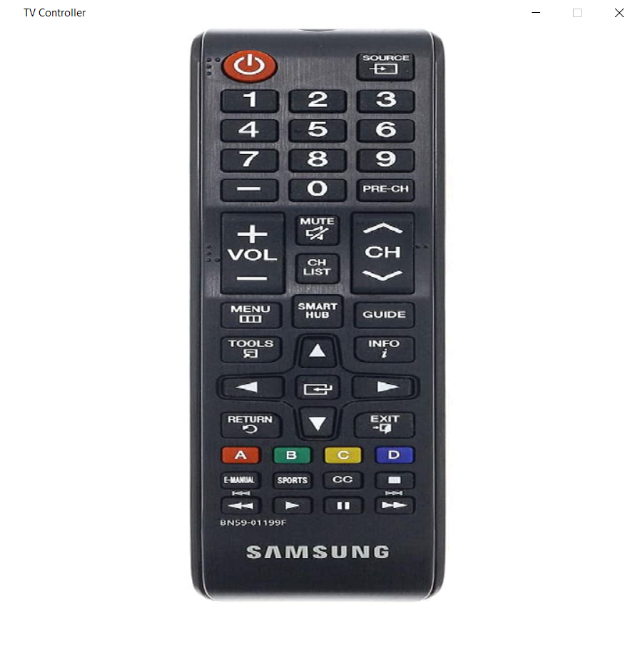
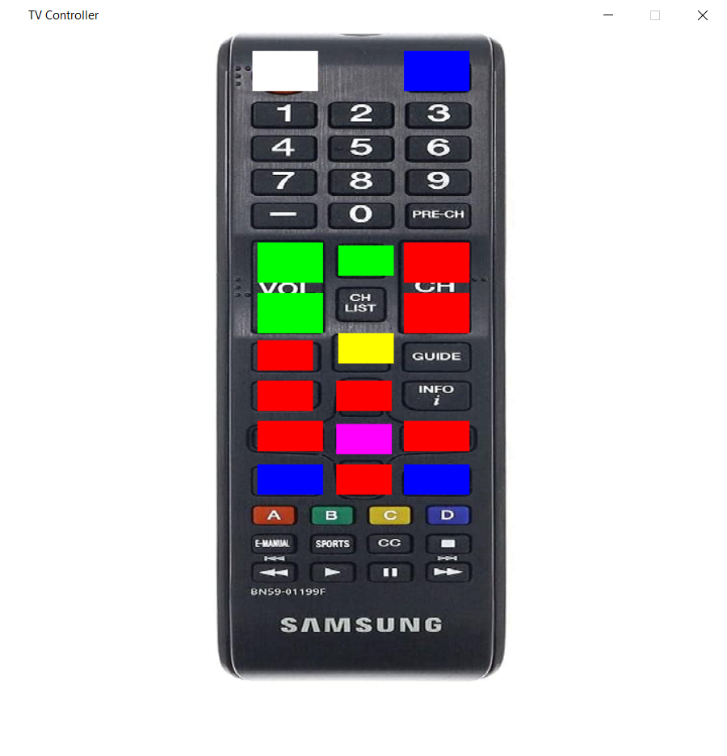

# Tv Remote
Controlling a Samsung TIZEN TV with the Samsung Smart TV API and pygame

This TV remote uses an interface in pygame to control a Tizen TV using [this library](https://github.com/xchwarze/samsung-tv-ws-api)

#### These are the binded buttons:

